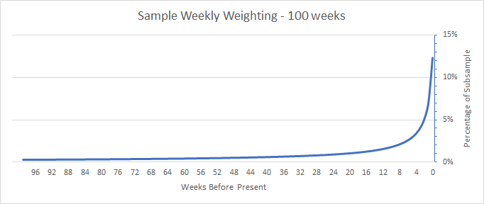

This document is under governance review. When the review completes as appropriate per local and agency processes, the project team will be allowed to remove this notice. This material is draft.

# US State and Territory [subsample datasets](doc_files/files.md) and [example builds](modular_nextstrain_profiles/)

### Index
1. [Overview and purpose](#overview)
2. [Example usage and customization](#usage)
    - [Available files](#available_files)
    - [Example build files](#build_files)
    - [Data set selection](#set_selection)
    - [Saving previous data files](#archived)
    - [Reference sequences](#references)
    - [Pangolin calls](#pangolin)
4. [Subsampling details](#subsampling)
    - [Unweighted samples](#unweighted)
    - [Weighted samples](#weighted)
    - [Weighted sampling algorithm](#weighted_algorithm)
5. [Other data sets](#data)
6. [Implementation](#program)
6. [FAQ (Frequently Asked Questions)](#faq)
8. [Notices and disclaimers](#notices)

## 1. OVERVIEW<a id="overview" />

This repository contains tools for building custom [Nextstrain](https://nextstrain.org/) phylogenetic analyses utilizing publicly-available sequence data and metadata from databases of [The National Center for Biotechnology Information (NCBI)](https://www.ncbi.nlm.nih.gov/).

These data provide users with pre-computed, up-to-date sequence and metadata files organized in a way that prioritizes:

 - **Simplified usage.**  Users are not required to download or manipulate the data in order to incorporate them into custom Nextstrain builds.
 - **Powerful customization.**  Users can further customized analyses by modifying the example Nextstrain `builds.yaml` files.
 - **Open data.**  All data is derived from publicly-available resources.
 - **Right-sized.**  Datasets subsampled to varied sizes are available to reduce computational demands.
 - **Correct formating.**  Sequence and metadata files are ready to be used in Nextstrain.
 - **Automatic updates.**  These datasets are routinely updated by the [Centers for Disease Control and Prevention (CDC)](https://www.cdc.gov/) and the latest version is automatically incorporated into builds using the remote URL.
 - **Pre-aligned sequences.**  Sequences are provided pre-aligned, allowing users to forgo the computationally demanding alignment step.
 - **Optional weighting.** Additional datasets with subsampling weighted to include more recently circulating strains are also provided.


These files differ from data used in the [Nextstrain SPHERES group builds](https://nextstrain.org/groups/spheres), which are derived from [GISAID's EpiCov](https://www.gisaid.org/) database. See [github.com/CDCgov/spheres-augur-build](https://github.com/CDCgov/spheres-augur-build) for more information about those builds.

## 2. EXAMPLE USAGE AND CUSTOMIZATION<a id="usage" />

#### Available files <a id="available_files" />
**The complete list of available datasets** is provided [here](doc_files/files.md) as remote paths to matched sequence alignment and metadata files with format similar to:  
```
https://s3.amazonaws.com/location/State/State-full-aligned.fasta.xz
https://s3.amazonaws.com/location/State/State-full-metadata.tsv.xz
```

#### Example build files <a id="build_files" />
Users can incorporate these data into local Nextstrain builds by simply using the remote paths to define an input in their `builds.yaml`:
```
inputs:
# Download 2000 sample unweighted data set
  - name: statedata
    aligned: https://s3.amazonaws.com/location/State/State-2000-unweighted-aligned.fasta.xz
    metadata: https://s3.amazonaws.com/location/State/State-2000-unweighted-metadata.tsv.xz
```
[Example build files](modular_nextstrain_profiles/) are also provided to guide users in developing their own custom analyses under three common build scenarios:

1. [**basic:**](modular_nextstrain_profiles/basic/)  The "basic" example build combines subsampled state data with a United States contextual background.

2. [**tristate:**](modular_nextstrain_profiles/tristate/)  The "tristate" example build demonstrates how data from one state can be easily combined with focused contextual data from neighboring states and sparsely sampled data from the rest of the United States.

3. [**hybrid:**](modular_nextstrain_profiles/hybrid/)  The "hybrid" example build combines subsampled state data with the user's local sequence data not submitted to public repositories. Additional contextual background from United States and global sequence data is also added.

To use these example builds:
```
cp -r spheres-state-subsample/modular_nextstrain_profiles <PATH TO NEXTSTRAIN INSTALLATION>
cd <PATH TO ncov installation>
conda activate nextstrain
snakemake --profile spheres-state-subsample/modular_nextstrain_profiles/<BUILD> --jobs 1
```
Results will be output to the `./auspice` directory.

Each of these example builds can be customized by editing `builds.yaml` to include any of the provided [subsampled datasets](doc_files/files.md) or adjust any Nextstrain parameters.

If the user is aware their sampled region has been sparsely sequenced (see [Subsampling details](#subsampling) below), the use of `soft` subsampling parameters in `builds.yaml` are recommended, such as `max_sequences: <DESIRED SAMPLES>`. Hard limits, such as `seq_per_group: <DESIRED SAMPLES>`, may exceed the number of available sequences in the input dataset and cause a failure in the augur pipeline.

#### Data set selection <a id="set_selection" />
Since each user's Nextstrain build will be customized to suit their needs, it is difficult to recommend specific files to include in your analysis.

In general, users should select the smallest data set that meets their required use case.  Smaller data sets will tend to require less compute time/memory and less bandwidth. When combining data from multiple sources in your analysis or when planning to keep a small number of samples from that input after subsampling, 1000 and 2000 size data sets are a good starting point.  On the other hand, if you have sufficient computational resources to produce a densely sampled final tree or you wish to apply your own specific subsampling criteria in your "builds.yaml" file, you may want to start with a larger data file (4000).  

Weighted and unweighted sets serve different purposes in an analysis.  Unweighted data is ideal to provide historical background data to a build or to serve as a source for custom subsampling defined in your "builds.yaml" file.  If you intend to apply ```group_by: "year month"``` to the input in your subsampling scheme, it is best to start with unweighted data which will provide better representation of sequences from earlier periods of the pandemic.  

Weighted data sets contain more data from recent weeks than earlier in the pandemic.  This data is more useful for evaluating recently circulating strains, however your subsampling options may be more limited due to the time bias in the input files.

The "full" data set is intended for advanced users who wish to create very large trees, preprocess the files using their own upstream processes, utilize sequences which may be potentially duplicated (identical nucleotide sequence), or utilize sequences shorter than the default 27,000 nucleotide cutoff used in the subsampled set.

Whether you are using weighted or unweighted data sets, you should always include some sequence data in your final subsample from earlier periods in the pandemic.  Not including a diverse enough background may negatively impact tree reconstruction, especially for deep splits in the tree.  Consider including a global background input, such as the global data set from [data.nextstrain.org](https://docs.nextstrain.org/projects/ncov/en/latest/reference/remote_inputs.html), in every build. 

#### Saving previous data files <a id="archived" />
There is no archive of previous data files provided.  Re-running your Nextstrain build will download the most recent data and overwrite previously downloaded data sets. If you wish to save a specific data set, you must manually copy that data to another location prior to re-running the build.  You can find the previously downloaded data files in your Nextstrain directory here:
```
ncov/s3.us-east-1.amazonaws.com/io-pe1-prod-ncezid-oamd-nextstrain/<STATE>/
```
Remember to save both the fasta sequence file and metadata tsv file.  The pangolin calls in these data files are current at the time of data set preparation, but when using archived data, we recommend that the user generate up to date lineage calls by [calling pangolin in their build](#pangolin).

#### Reference sequences <a id="references" />
Reference data required by Nextstrain is not included in these data sets, however the required data is included in the default ncov installation.  Users must include these data in the "inputs" of their builds.yaml file
```
  - name: references
    sequences: data/references_sequences.fasta
    metadata: data/references_metadata.tsv
```
See the [example builds](modular_nextstrain_profiles/basic/) for examples of how to include this in your builds.yaml.

#### Pangolin calls <a id="pangolin" />
While we provide the [pangolin lineage](https://cov-lineages.org/) call available on NCBI at the time of data download, pangolin lineage classifications are always being updated.  Users may want to run pangolin as part of their Nexstrain build to ensure that the latest calls are used or that the same pangolin version is used on both remote and local files.  We always recommend re-running pangolin if you are using [archived](#archived) data to ensure that the lineage calls are as up to date as possible.

Users can add pangolin to their workflow by including the following line in their builds.yaml file:
```
run_pangolin: true
```
Enabling pangolin calling by nextstrain requires [pangolin](https://github.com/cov-lineages/pangolin) to be installed or the ["--use-conda" flag provided to snakemake](https://discussion.nextstrain.org/t/make-reproducible-workflows-with-conda-environments-and-pinned-augur-versions/107).

## 3. SUBSAMPLING DETAILS <a id="subsampling" />
Subsampled data have been de-duplicated to remove isolates with identical sequence and datasets are provided in varied sizes of 1000, 2000, and 4000 sequences sampled by two different methods.

**NOTE:** If insufficient sequences are available to fill out a dataset at a given sample size (e.g. n=4000), the provided dataset contains *all* available de-deduplicated sequences. Although datasets are still produced for each subsample, the indicated size may not reflect the file contents. This is to ensure that remote paths to filenames remain stable over time so that subsample requests by users always return data.

#### Unweighted Subsamples <a id="unweighted" />
After de-duplication, unweighted subsamples are drawn randomly from all available sequences in the requested state or territory. These random samples will reflect any sampling biases present in the [NCBI database](https://www.ncbi.nlm.nih.gov/).  Among other factors, these biases may include case prevalence, sequencing capacity, or public health sequencing initiatives. 

Unweighted samples are nested such that the 1000 sequence set is a subset of the 2000 sequence set, which is a subset of the 4000 sample set. 

Example:
```
https://s3.amazonaws.com/location/State/State-1000-unweighted-aligned.fasta.xz
https://s3.amazonaws.com/location/State/State-1000-unweighted-metadata.tsv.xz
https://s3.amazonaws.com/location/State/State-2000-unweighted-aligned.fasta.xz
https://s3.amazonaws.com/location/State/State-2000-unweighted-metadata.tsv.xz
https://s3.amazonaws.com/location/State/State-4000-unweighted-aligned.fasta.xz
https://s3.amazonaws.com/location/State/State-4000-unweighted-metadata.tsv.xz
```


#### Weighted Subsamples <a id="weighted" />
After de-duplication, weighted subsamples are intentionally biased towards more recent collection dates to prioritize circulating strains. Sequences are weighted as [defined below](weighted-sampling-algorithm) and the weighted value is used to select the final weighted set. These weighted samples will reflect any sampling biases present in the [NCBI database](https://www.ncbi.nlm.nih.gov/).  Among other factors, these may include case prevalence, sequencing capacity, or public health sequencing initiatives.  The weighted sampling attempts to populate the data set as described [here](#weighted_algorithm) but is limited by the availability of sequence data.

Weighted samples are **not** nested, meaning sequences in the 1000 sequence set will not necessarily be present in the 2000 sequence set, nor will the 2000 sequence set necessarily be a subset of the 4000 sequence set.

```
https://s3.amazonaws.com/location/State/State-1000-weighted-aligned.fasta.xz
https://s3.amazonaws.com/location/State/State-1000-weighted-metadata.tsv.xz
https://s3.amazonaws.com/location/State/State-2000-weighted-aligned.fasta.xz
https://s3.amazonaws.com/location/State/State-2000-weighted-metadata.tsv.xz
https://s3.amazonaws.com/location/State/State-4000-weighted-aligned.fasta.xz
https://s3.amazonaws.com/location/State/State-4000-weighted-metadata.tsv.xz
```
It is not recommended to also use the subsampling instruction:
```
    group_by: "year month"
```
to further subsample a weighted dataset. The `group_by: "year month"` instruction attempts to unbias the selection by sampling evenly over time. This is contrary to the design of the weighted subsample dataset and may cause unintended effects on the final analysis. If even subsampling over time is desired in the final build, the "unweighted" data set should be used. See the [Nextstrain documentation](https://docs.nextstrain.org/projects/ncov/en/latest/analysis/customizing-analysis.html) for more information on subsampling parameters.

Data set size take precedence over fitting the subsample collection date distribution to the desired weighting.  For example, if a 4000 sequence data set is requested but only 3500 sequences exist across all time points, all 3500 sequences will be included in the weighted data set no matter when they were collected.

Similarly, an insufficient number of sequences in a [date bin](#weighted algorithm) will cause the weighted algorithm to select data from other date bins to fill out the requested data set size. 


##### Weighted sampling algorithm <a id="weighted_algorithm" />
Isolates are binned based on the number of 7-day periods prior to the current date that
the sample was collected, with the current week assigned as bin #1. Relative weighting of the
date bin is calculated as
```
    (1/bin) ** 0.8
```
with individual isolates weighted as
```
    bin weight / count of isolates in bin
```
Absolute weighting is determined by summing isolate weights and dividing each weight by
that sum, normalizing the total weight to 1.

The resulting subsample is heavily biased towards recent sequencing activity according to collection date. This is intended to focus the subsample on currently circulating strains independent of the rate of SARS-CoV-2 sequencing.



## 4. OTHER DATA SETS<a id="data" />

The Nextstrain team has prepared several remote open data files corresponding to global and regional data sets. 
You can find information on other available files and instruction on adding them to your builds [here](https://docs.nextstrain.org/projects/ncov/en/latest/reference/remote_inputs.html). 
These files can be combined with state subsampling data sets and query parameters to perform more complex analyses.

## 5. PROGRAM USAGE<a id="program" />

Code used for preparing the subsampled datasets is provided for transparency and  customization by end users. Note that the program relies on access to an internal database of NCBI sequence and metadata to run successfully.  

#### `subsample_states-parallel.py`
```
usage: subsample_states.py [-h] -s STATE -u USADATA [-r [REFDATA]]
                                    [-n [NORMFILE]] [-m [MINLENGTH]] -o OUTPUT

Extract and normalize NCBI state/territory data and metadata

optional arguments:
  -h, --help            show this help message and exit
  -s STATE, --state STATE
                        State or territory name
  -u USADATA, --usaData USADATA
                        USA metadata file
  -r [REFDATA], --refData [REFDATA]
                        Wuhan reference data file
  -n [NORMFILE], --normFile [NORMFILE]
                        File to be used to normalize country/state names
  -m [MINLENGTH], --minLength [MINLENGTH]
                        Minimum genome length
  -o OUTPUT, --output OUTPUT
                        Output directory
```
Resulting state or territory specific `fasta` and `tsv` files will be organized in the defined `--output` directory parameter.

## 6. FAQ (Frequently Asked Questions)<a id="faq" />
1. **How frequently are these data sets updated?**

    *These files are updated weekly on Monday evening.*
    
2. **How do I get access to an earlier release of a data set?**

    *Previous data sets are not archived.  To keep a previous data set, see the instructions [here](#archived).  
    If you re-use data sets you have manually archived, please be aware that you should update it with the most
    current pangolin lineage calls (see [here](#pangolin)).*
    
3. **What changes from week to week?**

    *New sequences will be added based upon the most recent contents of NCBI.  Additionally, any revisions or
    revocations to the NCBI data will be reflected in the release.  Any changes to the pangolin lineage
    provided by NCBI will also be present in the new data set.*
    
    *[Downsampled unweighted sets](#unweighted) will have a different randomized set of sequences in them.*
    
    *[Downsampled weighted sets](#weighted) will have a [different weighting](#weighted_algorithm) applied to the sequences to
    continue to provide data representative of the most recently circulating strains.*
        
4. **Can I share this data?**

    *All data is derived from publicly available data on NCBI.*
    
5. **How is this data intended to be used?**

    *This data is provided to allow users to include the most recently available data in a Nextstrain build
    without having to modify their nextstrain build file or manually interact with the files or file contents.  File paths do not change from week to week, so your build file will always download the most recent version of the file.*
    
    *Basic use cases include a weekly build using only remote data that can simply be re-run to provide an updated 
    Nexstrain auspice file or using these files to simplify adding background context to a custom analysis.  Advanced
    users may wish to use these files as a basis for their own filtering or subsampling schemes.*
    
    *See the [data set selection](#set_selection) section for more advice on selecting which input files are 
    appropriate for your use.*
    
    

## 7. Notices and Disclaimers<a id="notices" />
### Public Domain Standard Notice
This repository constitutes a work of the United States Government and is not
subject to domestic copyright protection under 17 USC § 105. This repository is in
the public domain within the United States, and copyright and related rights in
the work worldwide are waived through the [CC0 1.0 Universal public domain dedication](https://creativecommons.org/publicdomain/zero/1.0/).
All contributions to this repository will be released under the CC0 dedication. By
submitting a pull request you are agreeing to comply with this waiver of
copyright interest.

### License Standard Notice
The repository utilizes code licensed under the terms of the Apache Software
License and therefore is licensed under ASL v2 or later.

This source code in this repository is free: you can redistribute it and/or modify it under
the terms of the Apache Software License version 2, or (at your option) any
later version.

This source code in this repository is distributed in the hope that it will be useful, but WITHOUT ANY
WARRANTY; without even the implied warranty of MERCHANTABILITY or FITNESS FOR A
PARTICULAR PURPOSE. See the Apache Software License for more details.

You should have received a copy of the Apache Software License along with this
program. If not, see http://www.apache.org/licenses/LICENSE-2.0.html

The source code forked from other open source projects will inherit its license.

### Privacy Standard Notice
This repository contains only non-sensitive, publicly available data and
information. All material and community participation is covered by the
[Disclaimer](https://github.com/CDCgov/template/blob/master/DISCLAIMER.md)
and [Code of Conduct](https://github.com/CDCgov/template/blob/master/code-of-conduct.md).
For more information about CDC's privacy policy, please visit [http://www.cdc.gov/other/privacy.html](https://www.cdc.gov/other/privacy.html).

### Contributing Standard Notice
Anyone is encouraged to contribute to the repository by [forking](https://help.github.com/articles/fork-a-repo)
and submitting a pull request. (If you are new to GitHub, you might start with a
[basic tutorial](https://help.github.com/articles/set-up-git).) By contributing
to this project, you grant a world-wide, royalty-free, perpetual, irrevocable,
non-exclusive, transferable license to all users under the terms of the
[Apache Software License v2](http://www.apache.org/licenses/LICENSE-2.0.html) or
later.

All comments, messages, pull requests, and other submissions received through
CDC including this GitHub page may be subject to applicable federal law, including but not limited to the Federal Records Act, and may be archived. Learn more at [http://www.cdc.gov/other/privacy.html](http://www.cdc.gov/other/privacy.html).

### Records Management Standard Notice
This repository is not a source of government records, but is a copy to increase
collaboration and collaborative potential. All government records will be
published through the [CDC web site](http://www.cdc.gov).

### Additional Standard Notices
Please refer to [CDC's Template Repository](https://github.com/CDCgov/template)
for more information about [contributing to this repository](https://github.com/CDCgov/template/blob/master/CONTRIBUTING.md),
[public domain notices and disclaimers](https://github.com/CDCgov/template/blob/master/DISCLAIMER.md),
and [code of conduct](https://github.com/CDCgov/template/blob/master/code-of-conduct.md).
